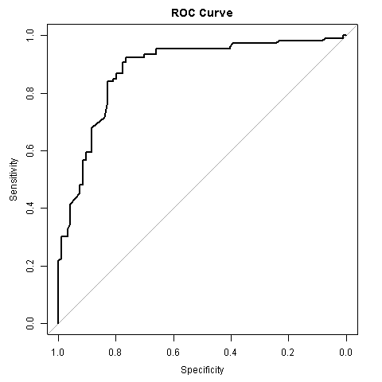
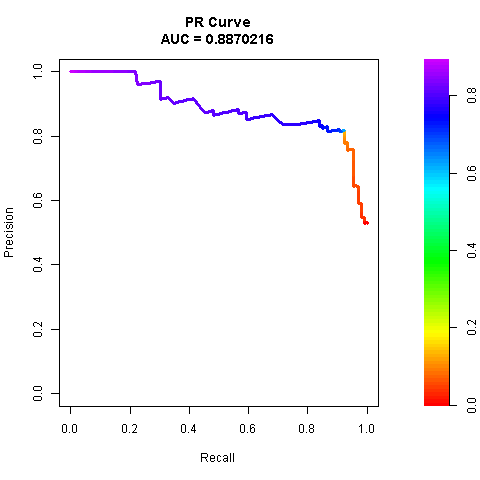

# Introduction:

This report includes the analysis of churn data and report on the raw data processing.

# Data cleaning process:
The raw data was cleaned using dplyr library. The process included replacing bad strings, converting columns to correct types and fixing any inconsistencies and accounting for missing values.

```{r table, echo=FALSE}
library(knitr)
df <- read.csv(params$data_file)
kable(head(df), caption = "Top 5 rows of the final data file")
```

# Visualization of model evaluation metrics:
The report includes the ROC and PR curves plotted to evaluate the model's performance.

```{r, echo = FALSE}

```

```{r, echo = FALSE}

```

# Conclusion:
The AUC for the ROC curve is 0.881 which indicates the model's high overall performance,  still with available room for improvement but overall good results. The PR curve AUC is 0.887 indicating the model's high precision for rare event detection. Overall the model's performance is satisfying with a high possibility to become perfect after further fascilation.

